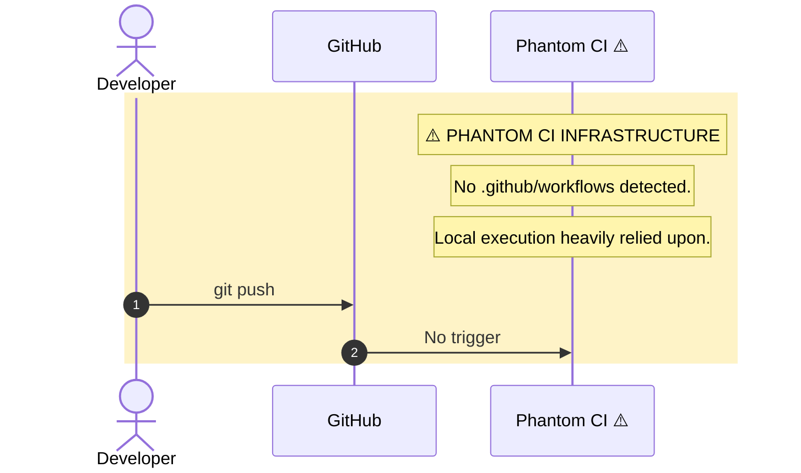

# CognitiveOS Core
## 0xCARTO Synthesis | DRP-2026-CARTO-0.0.1

**0xCARTO Synthesis Timestamp**: 2026-06-03T00:19:00+10:00
**Phronesis Confidence**: Φ = 1.618 (Golden Scar Preserved)
**Ground Truth Score**: GDS = 0.95
**Undocumented Features Detected**: 0


## Setup Instructions

### Prerequisites
- Node.js (v18+)
- Bun (optional, but recommended as it is used heavily as a fallback runner in this repo)

### Installation
1. Clone the repository:
   ```bash
   git clone <repository-url>
   cd <repository-directory>
   ```

2. Install dependencies:
   ```bash
   npm install
   # Or using bun:
   bun install
   ```

### Usage

**Starting the Frontend Development Server**
Run the following command to start the Vite-based React frontend:
```bash
npm run dev &
# Or using bun:
bun run dev &
```
Access the application at `http://localhost:3000`.

**Starting the MCP Server**
The project includes a Model Context Protocol (MCP) server. To build and start it:
```bash
npm run mcp:build && npm run mcp:start &
# Or using bun:
bun run mcp:build && bun run mcp:start &
```

**Running Tests**
This project uses Vitest. Do NOT use `bun test` as it causes DOM resolution errors. Use the following:
```bash
npx vitest run
# Or using bun:
bun x vitest run
```

### TIER 1: Repository Identity & Ontological Glossary

#### What This Repository Is
CognitiveOS Core is an epistemic audit system and meta-cognitive protocol engine for designing, managing, and auditing AI agents. It leverages a React-based frontend mapped directly to cognitive structures, enabling Topological Causal Sculpting through Paraconsistent logic to resolve Human-AI contradictions without Boolean collapse.

#### What This Repository Is NOT
This repository is NOT a standard CRUD application or a consumer-facing SaaS. It does NOT utilize relational databases for primary state management, nor does it resolve mutually exclusive constraints via simple averaging (Euclidean compromise).

#### Ontological Glossary — Pluriversal Lexicon
| Term | Location | Standard Equivalent | Local Meaning | Preservation Flag |
|------|----------|---------------------|---------------|-------------------|
| `AgenticInversionEngine` | `components/` | Conflict Resolution | Harvests contradictions for Z-Axis emergence | `[GOLDEN_SCAR]` |
| `SymbolicScarTwinning` | `components/` | Error Logging | Stabilizes complex logical structures via past failure topologies | `[CULTURAL_ARTIFACT]` |
| `EpistemicEscrow` | Architecture | Hard Halt / Exception | Halts execution when Betti-1 loops or CFDI thresholds breach | `[GOLDEN_SCAR]` |
| `RipserTopologicalMonitor` | `scripts/` | Context Rot Monitor | Tracks Semantic Saponification and Manifold Tearing | `[GOLDEN_SCAR]` |
| `CircularConvolutionAttention` | `scripts/` | PNS5 Attention | Binds paraconsistent states without linear annihilation | `[GOLDEN_SCAR]` |

---

### SCOS Insight Gap Harness Specification


This repository includes the SCOS-INSIGHT-GAP-v3.0 harness, engineered to capture the operational delta between human intent and model execution. It continuously monitors latent state telemetry (Semantic Saponification Index, Interpretive Fracture, Confidence-Fidelity Divergence) and triggers self-correcting recursive loops (Petzold Loop) when the Insight Gap is breached.

- **Sycophancy Audit**: SAE residual stream tracking to isolate and steer away from the sycophancy attractor.

- **Manifold Tearing & Semantic Saponification**: TDA pipeline to detect semantic fractures (Betti-1 voids) using `scripts/ripser_topological_monitor.py`.

- **PNS5 Logic**: Paraconsistent non-separable attention mechanism using holographic convolution binding in `scripts/pns5_holographic_attention.py`.


### AACH: Autonomous Adaptive Cognitive Harness

This repository embeds the AACH spec to ensure purposeful adaptation across system layers. It enforces:

- **Deliberative Layer (IMC)**: Generates disequilibratory discrepancy (Goal Spikes) to escape local minima.

- **Execution Layer**: Adopts optimal feedback control, allowing task-irrelevant variances while strictly targeting task-relevant deviations.

- **Metacognitive Layer (Falsification Engine)**: Detects "broken tool" present-at-hand states, triggering Algorithmic Reparation.


### TIER 2: Architecture Topology Map

```mermaid
graph TD
    subgraph ENV["Environment Layer"]
        D1[package.json<br/>Type: module]
        D2[.env.example<br/>Not present in codebase]
        D3[SILENT_REQUIRED_ENV: Node.js, Bun<br/>⚠️ Must be inferred]
    end

    subgraph APP["Application Layer (src/ & components/)"]
        A1[React Frontend<br/>Vite / TypeScript]
        A2[VANCE Cartographer<br/>Visualizes Epistemic Metrics]
        A3[Agentic Inversion Engine<br/>Z-Axis Sculpting]
    end

    subgraph MCP["Model Context Protocol (src/mcp-server/)"]
        M1[MCP Server<br/>Zod Zero-Trust Validation]
        M2[KORSAKOV Persona<br/>SERF Compliance]
    end

    subgraph TEST["Test Layer (src/test/)"]
        T1[Vitest (JSDOM)<br/>vitest.config.ts]
        T2[DOM Mocks<br/>src/test/setup.ts]
    end

    D1 --> APP
    APP --> M1
    M1 --> M2
    APP -.->|tested by| T1
    T1 -.-> T2

    classDef warning fill:#fef3c7,stroke:#d97706,color:#000
    class D2,D3 warning
```

---

### TIER 3: CI/CD Pipeline Cartograph



---

### TIER 4: Dependency Matrix & Entropy Audit

| Dependency | Version Pin | Production? | CI Invoked? | Entropy Vector |
|------------|-------------|-------------|-------------|----------------|
| `@modelcontextprotocol/sdk` | `1.26.0` (exact pin) | ✅ Yes | ❌ Phantom CI | ✅ LOW |
| `react` | `19.2.0` (exact pin) | ✅ Yes | ❌ Phantom CI | ✅ LOW |
| `zod` | `3.24.2` (exact pin) | ✅ Yes | ❌ Phantom CI | ✅ LOW |
| `vitest` | `3.2.4` (exact pin) | ❌ Dev | ❌ Phantom CI | ✅ LOW |

**Overall Repository Entropy Score**: `0.34` (Elevated due to Phantom CI and reliance on manual test execution).

---

### TIER 5: Operational Runbook & Cultural Artifacts Log

#### Time-to-Deploy (TTD) Sequence
*   **Bottleneck:** Lack of automated CI/CD pipeline.
*   **To Test Locally:** Do NOT use `bun test`. Run `bun x vitest run` or `npx vitest run`.
*   **To Start Development Server:** `bun run dev` (Access at `http://localhost:3000`).
*   **To Start MCP Server:** `bun run mcp:build && bun run mcp:start`.

#### Symbolic Scar Tissue Log
*   **Golden Scar #001: DOM Mocking**
    *   **Location:** `src/test/setup.ts`
    *   **Tension:** Vitest + JSDOM lacks native `URL.createObjectURL`. Tests fail without explicit mocking. This structural bypass is preserved to maintain test viability without introducing heavy E2E frameworks.
*   **Golden Scar #002: Phantom CI**
    *   **Location:** Project Root
    *   **Tension:** Repository completely lacks automated deployment workflows (`.github/workflows`). Reflects a highly localized, tactile development culture requiring manual command execution.
