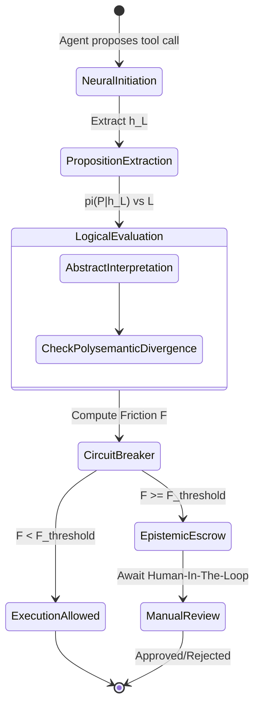

# Engineering a Hybrid Neuro-Symbolic Gatekeeper using Differentiable Logic Programming and Abstract Interpretation

This specification details a neuro-symbolic auditing gateway designed to intercept, analyze, and formalize AI agent tool-calling sequences before they are executed.

## 1. The Propositional Probe Module

The module intercepts the hidden state $h_L$ from the final layer of the LLM just before token sampling for a tool call. We define a set of safety propositions $P = \{p_1, p_2, \dots, p_k\}$ (e.g., $p_1$: "Tool modifies filesystem", $p_2$: "Target path is restricted").

A learned linear projection $W_P$ maps the hidden state to a probability distribution over these propositions:

$$ \pi(P|h_L) = \sigma(W_P h_L + b_P) $$

Where $\pi(p_i)$ represents the model's latent belief that proposition $p_i$ is true.

## 2. Differentiable Logic Programming

The projected probabilities $\pi(P|h_L)$ are evaluated against the immutable declarative policy $\mathcal{L}$ defined in `GEMINI.md`. Using a Differentiable Logic framework (like TorchDEQ), logical AND ($\land$), OR ($\lor$), and NOT ($\neg$) operations are softened using t-norms (e.g., Product t-norm):

*   $T_{\land}(a, b) = a \cdot b$
*   $T_{\lor}(a, b) = a + b - a \cdot b$
*   $T_{\neg}(a) = 1 - a$

The compliance of the proposed action given the rules is formulated as a differentiable loss function $L_{logic}(\pi, \mathcal{L})$. A lower loss indicates higher compliance with the safety constraints.

## 3. Abstract Interpretation of Toolchains

We abstract the sequence of intended API calls into a "Soft Permission vs. Functional Misuse Lattice".

*   **Abstraction Function $\alpha$:** Maps concrete arguments (e.g., `path="/etc/passwd"`) to abstract domains (e.g., `path=SYSTEM_CRITICAL`).
*   **Concretization Function $\gamma$:** Maps abstract domains back to sets of concrete states.

The abstract transformer for an API call evaluates the preconditions on the abstract state. If an action like `update_metadata(target=SYSTEM_CRITICAL)` is proposed, the abstract interpreter detects a **Polysemantic Divergence**—a permitted API call being leveraged outside its intended domain.

## 4. The Epistemic Circuit Breaker

The system calculates a 'Friction Coefficient' $\mathcal{F}$ by comparing formal logical compliance ($C_{formal}$, derived from abstract interpretation) against the neural model's probability weight ($P_{neural}$, derived from token logits):

$$ \mathcal{F} = \lambda_1 \left( 1 - C_{formal} \right) + \lambda_2 \left\| C_{formal} - P_{neural} \right\|_2 $$

### State Transition Lifecycle

If $\mathcal{F} \ge \mathcal{F}_{threshold}$, the Escrow loop halts the execution and demands manual verification.
