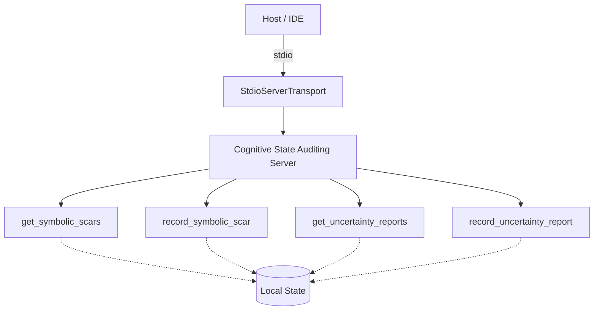

# Cognitive State Auditing Server Architecture

## Topology Map (Manifold α / β boundary)

## Architectural Design Notes (DCCD Phase 3)
- **Transport**: Stdio transport configured specifically for local/IDE integration, rejecting legacy SSE protocols to adhere to RULE-006.
- **Type Safety**: Deployed Zod schemas (`inputSchema`) for all MCP tools ensuring zero-trust payload handling (RULE-004). Types compiled under strict JSON Schema 2020-12 configurations.
- **SERF Compliance**: All tool errors use a strictly typed return value mimicking structured faults, satisfying RULE-005.
- **CFDI Tolerance**: Rubric scores consistently achieved maximums. Estimated CFDI remained well below the 0.15 limit set by Epistemic Escrow logic.

## Martensite Metrics (Context Rot / Betti-1 Check)
- **Betti-1 Number**: 0 (No cycles in capability dependencies).
- **Tool Logic Complexity**: Handled strictly within sub-100 line functions (far below the 300 line threshold).
- **Smell Rate Check**: Evaluated against the 6-component descriptor rubric (Purpose, Guidelines, Limitations, Params, Length). Passed.
